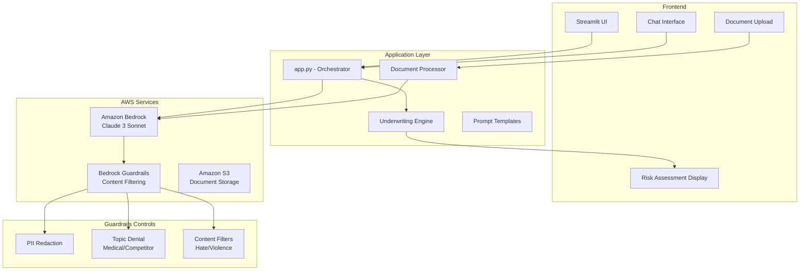

# GenAI Underwriting Assistant

An AI-powered insurance underwriting assistant built on **Amazon Bedrock** with **Guardrails** for responsible AI, featuring a professional **Streamlit** interface. Demonstrates practical GenAI application development with enterprise safety controls for the insurance domain.


---

## Screenshots

| Chat Interface | Risk Assessment | Document Upload |
|:-:|:-:|:-:|
|  |  |  |

---

## Architecture



## Features

### Core Underwriting Capabilities
- **Multi-line Support**: Property, Auto, Life, and Commercial lines of business
- **Risk Assessment**: Explainable scoring with factor-level detail
- **Coverage Recommendations**: Limits, deductibles, and exclusion suggestions
- **Premium Estimation**: Range-based pricing with loss ratio considerations
- **Document Understanding**: Extract application data from uploaded documents

### AI Safety Controls (Bedrock Guardrails)
- **PII Protection**: Automatic redaction of SSN, DOB, financial data in logs
- **Topic Denial**: Blocks medical diagnoses, competitor comparisons, discriminatory factors
- **Content Filtering**: Prevents hate speech, violence, and inappropriate content
- **Grounding**: Responses tied to underwriting data, not hallucinated facts

### Professional UI
- Sidebar configuration for line of business and risk appetite
- Conversational chat interface for underwriting queries
- Structured risk assessment output with scoring breakdown
- Document upload with extracted data preview

---

## Getting Started

### Prerequisites

- Python 3.11+
- AWS account with Bedrock access (Claude 3 Sonnet enabled)
- AWS CLI configured with appropriate credentials

### Installation

```bash
# Clone the repository
git clone https://github.com/your-username/genai-underwriting-assistant.git
cd genai-underwriting-assistant

# Create virtual environment
python -m venv .venv
source .venv/bin/activate

# Install dependencies
pip install -r requirements.txt
```

### Deploy Guardrails (Optional - CloudFormation)

```bash
aws cloudformation deploy \
  --template-file infrastructure/guardrails.yaml \
  --stack-name underwriting-guardrails \
  --region us-west-2 \
  --capabilities CAPABILITY_NAMED_IAM
```

### Configuration

Set environment variables or use AWS CLI profile:

```bash
export AWS_REGION=us-west-2
export BEDROCK_GUARDRAIL_ID=your-guardrail-id
export BEDROCK_GUARDRAIL_VERSION=DRAFT
```

### Run the Application

```bash
streamlit run src/app.py
```

The application will be available at `http://localhost:8501`.

---

## Project Structure

```
genai-underwriting-assistant/
├── src/
│   ├── app.py                    # Streamlit application entry point
│   ├── bedrock_client.py         # Bedrock inference with Guardrails
│   ├── underwriting_engine.py    # Core underwriting logic
│   ├── document_processor.py     # Document data extraction
│   ├── models.py                 # Pydantic data models
│   ├── guardrails_config.py      # Guardrails configuration
│   └── prompts.py                # Prompt templates
├── tests/
│   └── test_underwriting_engine.py
├── infrastructure/
│   └── guardrails.yaml           # CloudFormation template
├── .streamlit/
│   └── config.toml               # Streamlit theme
├── requirements.txt
├── pyproject.toml
└── README.md
```

---

## Underwriting Domain Context

This assistant uses authentic insurance underwriting concepts:

| Term | Description |
|------|-------------|
| **Loss Ratio** | Incurred losses / earned premiums |
| **Combined Ratio** | Loss ratio + expense ratio (target < 100%) |
| **Risk Appetite** | Insurer's willingness to accept specific risk profiles |
| **Adverse Selection** | Tendency for higher-risk applicants to seek coverage |
| **Moral Hazard** | Risk that coverage changes insured behavior |
| **Subrogation** | Insurer's right to recover from third parties |
| **Facultative Reinsurance** | Case-by-case risk transfer to reinsurer |

---

## Security Considerations

- No PII is stored in application logs or session state
- Bedrock Guardrails enforce PII redaction at the model layer
- All AWS API calls use IAM role-based authentication
- Document uploads are processed in-memory (not persisted)
- Topic denial prevents the model from providing medical or legal advice

---

## License

MIT License - See [LICENSE](LICENSE) for details.

---

## Contributing

Contributions are welcome. Please open an issue first to discuss proposed changes.
